# Spring AI Agent — KOSTA 8시간 강의 실습 저장소

KOSTA Spring AI 8시간 강의 수강생을 위한 단계별 누적 학습 저장소입니다. 각 폴더는 독립적으로 빌드/실행 가능한 완전한 Spring Boot 프로젝트이며, 한 단계씩 따라가면서 자연스럽게 Memory, Tool Calling, RAG, Advisor Chain, 운영 안정화까지 학습할 수 있도록 구성되어 있습니다.

## 사전 준비

- **Java 21** (Temurin/Adoptium 권장)
- **OpenAI API 키** — 환경변수 `OPENAI_API_KEY` 로 주입
- (선택) `httpie`, `jq` 등 REST 호출 도구

> 별도의 데이터베이스 서버나 도커는 필요하지 않습니다. 첫 부팅 시 `./data/agentdb.mv.db` H2 파일이 자동으로 생성됩니다.

## 진행 방법

1. 본 저장소를 클론합니다.
2. `step0-base` 폴더로 이동하여 README 안내를 따라 빌드/실행합니다.
3. 동작이 확인되면 `step1-chat`으로 넘어가 같은 방식으로 진행합니다.
4. step6까지 단계별로 진행하면서 각 단계의 `CHANGES.md`로 어떤 파일이 추가/변경되었는지 확인합니다.

> 각 step은 이전 step의 모든 파일을 포함하므로, 한 폴더만 IDE에 열어도 그 단계 학습을 완수할 수 있습니다.

## 단계 구성

| 단계 | 폴더 | 추가 요소 | 시간표(예시) | 관련 LO |
|------|------|----------|--------------|---------|
| 0 | `step0-base` | 도메인 + REST CRUD (AI 없음) | 09:00-09:50 (1블록) | LO-Spring AI 개요 |
| 1 | `step1-chat` | + ChatClient (단순 챗봇) | 09:50-10:50 | LO-ChatClient |
| 2 | `step2-memory` | + Structured Output 데모 + JDBC ChatMemory | 11:00-12:00 | LO-Memory & Structured Output |
| 3 | `step3-tools` | + Tool Calling 4종 (조회 + 취소) | 13:00-14:30 | LO-Tool Calling |
| 4 | `step4-rag` | + SimpleVectorStore RAG (정책 문서 3개) | 14:30-15:50 | LO-RAG |
| 5 | `step5-agent` | + Advisor Chain (SafeGuard, Logger 통합) + SSE | 16:00-17:00 | LO-Advisor Chain |
| 6 | `step6-prod` | + Resilience4j, 모더레이션, 메트릭, 야간 잡 | 17:00-18:00 | LO-Production |

## 공통 인프라

모든 step은 다음을 공유합니다.

- **H2 파일 모드** — 외부 DB 서버 없이 `./data/agentdb` 파일에 영속화
- **JDBC ChatMemory** — Spring AI 자동 구성으로 `SPRING_AI_CHAT_MEMORY` 테이블 자동 생성
- **SimpleVectorStore** — 외부 벡터 DB 없이 `./data/vector-store.json` 파일에 임베딩 영속화 (step4 이상)
- Spring Boot 3.5.0 / Spring AI 1.1.5 (2026-04-27 GA)
- 패키지 베이스: `com.kosta.agent.{config, domain, web, tool, rag, advisor, scheduled}`

### 강의 시작 시

```bash
# 환경변수 설정 (강사 제공)
export OPENAI_API_KEY=sk-...

# 어느 step이든 폴더로 이동 후
cd step1-chat && ./gradlew bootRun

# step 전환 시 Ctrl+C로 종료 후 다음 폴더로 이동
cd ../step2-memory && ./gradlew bootRun
```

H2 파일(`./data/agentdb.mv.db`)과 벡터 저장소(`./data/vector-store.json`)는 각 step 폴더의 `data/` 디렉터리에 생성됩니다. step 간 데이터 공유가 필요하면 해당 파일을 복사하면 됩니다.

### 데이터 흐름

| step | 사용/생성하는 테이블 |
|------|--------------------|
| step0~3 | `customers`, `orders` (DataSeeder가 첫 부팅 시 생성) |
| step2 이상 | + `SPRING_AI_CHAT_MEMORY` (Spring AI 자동 생성) |
| step4 이상 | + `vector-store.json` 파일 (SimpleVectorStore 영속화) |

### 운영 환경 전환 (참고)

본 강의는 학습 부담을 줄이기 위해 H2 파일과 SimpleVectorStore를 사용합니다. 운영 환경에서는 `application.yml`의 `datasource.url`을 PostgreSQL로, `VectorStore` Bean을 pgvector·Redis·Supabase 등으로 교체하면 동일한 코드가 그대로 동작합니다. 이는 Spring의 PSA(Portable Service Abstraction) 가치 그 자체입니다.

## 학습 체크리스트

- [ ] step0: `/api/orders`, `/api/customers` 호출이 정상 응답한다
- [ ] step1: `/api/agent`로 한국어 응답을 받는다
- [ ] step2: 같은 `conversationId`로 두 번 호출하면 이전 발화를 기억한다
- [ ] step3: "내 ORD-1 취소해줘" 요청에 도구가 호출되고 DB가 갱신된다
- [ ] step4: "환불 정책 알려줘" 요청에 RAG가 동작해 정책 문장을 인용한다
- [ ] step5: SafeGuard가 민감어를 차단하고 SSE 스트리밍이 정상 동작한다
- [ ] step6: Actuator `/actuator/prometheus`에서 메트릭 확인, 모더레이션 차단 응답 확인

## 데모 화면 (자동 캡처)

각 step의 정적 UI는 `./gradlew bootRun` 후 http://localhost:8080 에서 확인할 수 있습니다. 아래는 각 step 진입 시 + 대표 시나리오 실행 후 자동 캡처된 모습입니다.

### step1 — 단발 chat
| 초기 | 응답 |
|---|---|
| 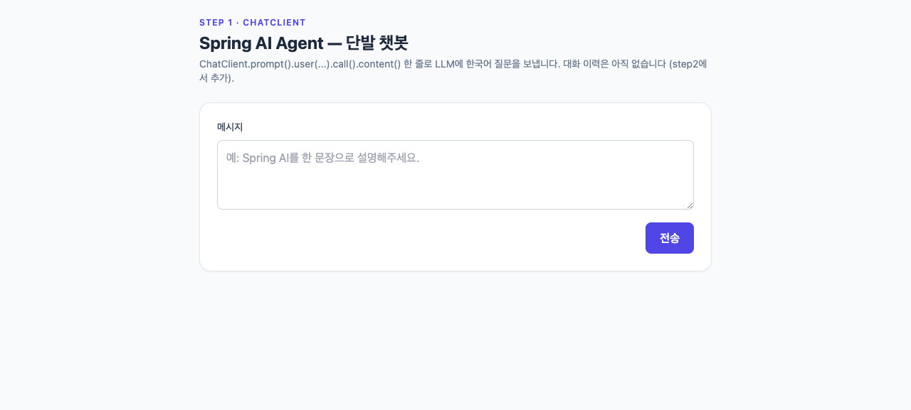 | 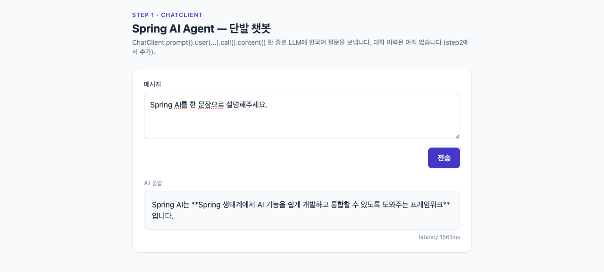 |

### step2 — 대화 이력 유지
이름 입력 후 같은 conversationId로 회상.

| 이름 입력 | 회상 |
|---|---|
| 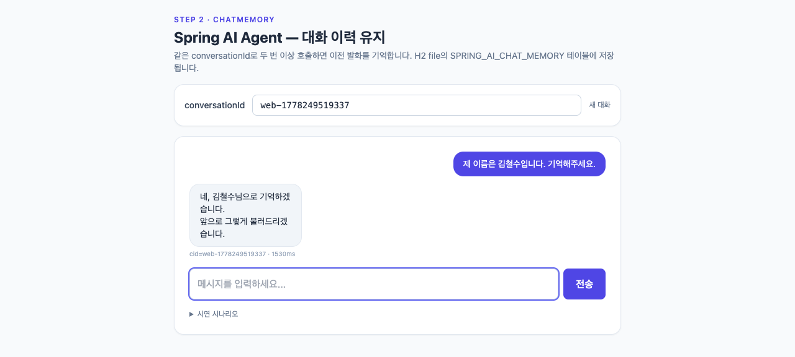 | 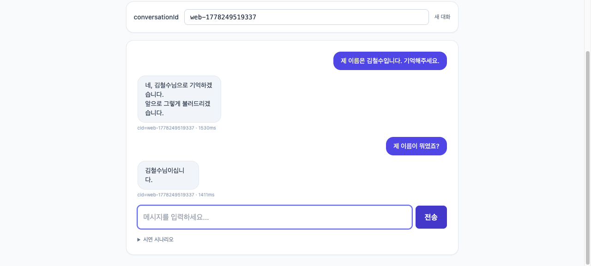 |

### step3 — Tool Calling
시나리오 버튼 클릭 한 번에 LLM이 OrderTools를 호출해 DB에서 주문을 조회.

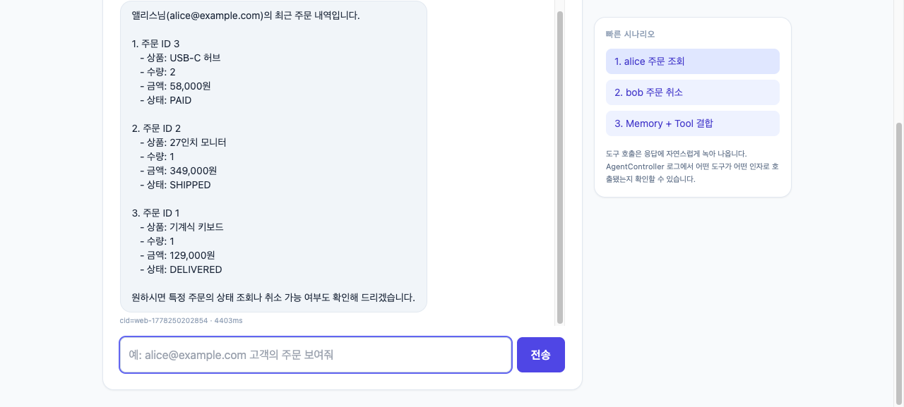

### step4 — RAG
정책 문서 인덱싱 후 환불 질문 → 정책 인용 답변.

| 인덱싱 완료 | RAG 답변 |
|---|---|
| 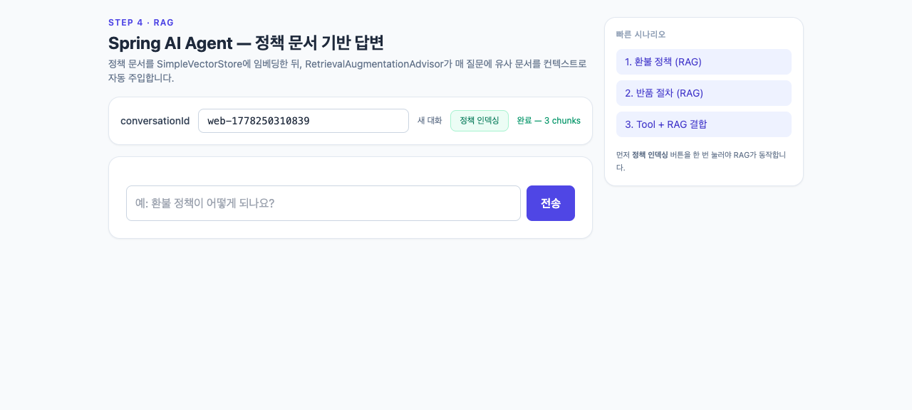 | 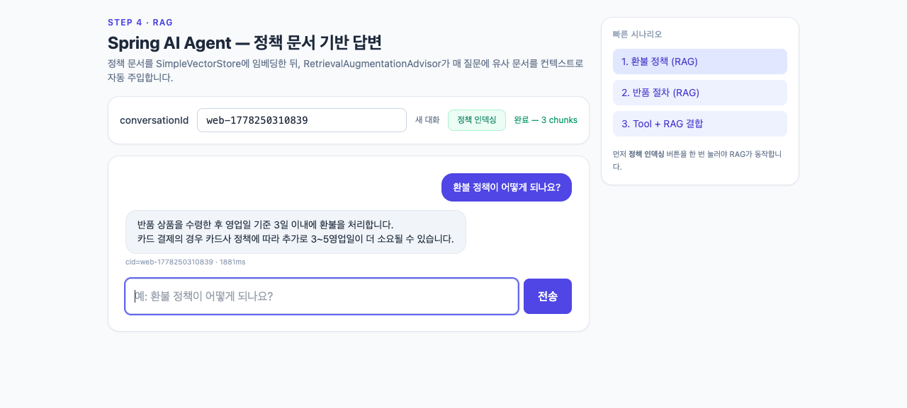 |

### step5 — 종합 Agent (Memory + RAG + Tool + SafeGuard)
한 질문에서 Tool과 RAG가 함께 동작.

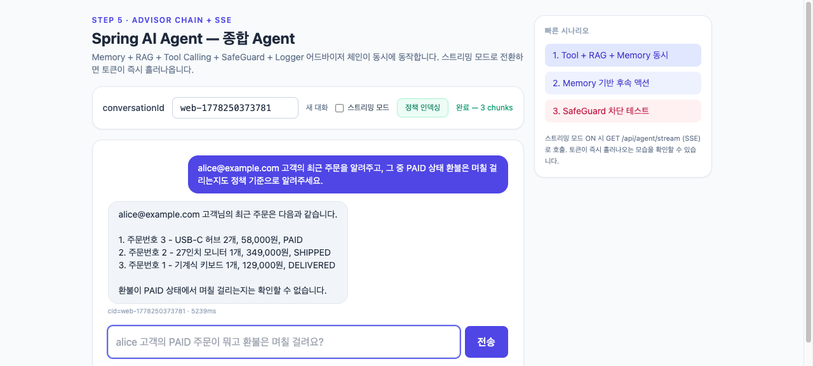

### step6 — 운영 안정화
finish_reason 표시, SafeGuard 차단 시 warning, /actuator 링크.

| Tool | RAG | Memory 회상 | SafeGuard 차단 |
|---|---|---|---|
| 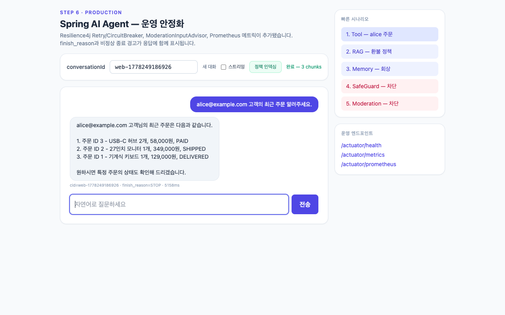 | 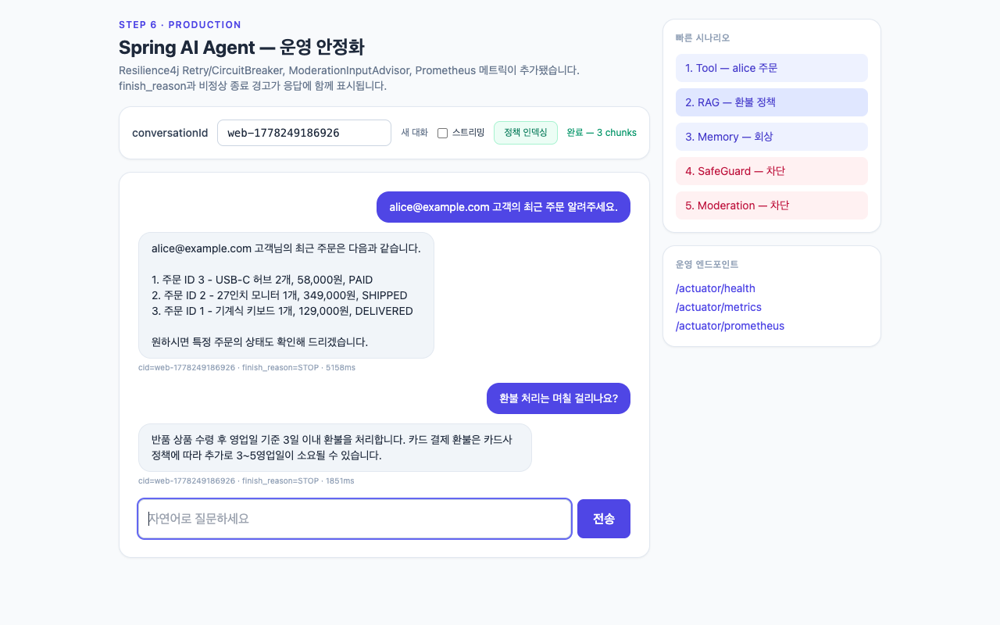 | 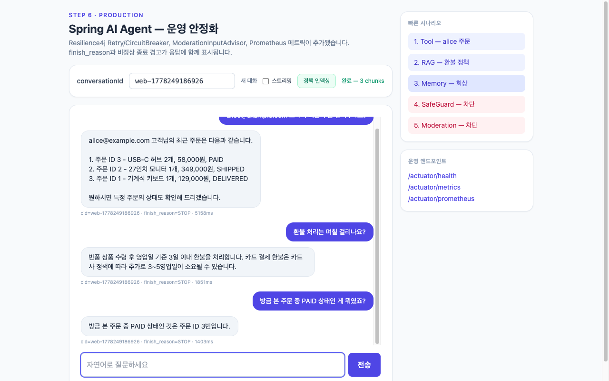 | 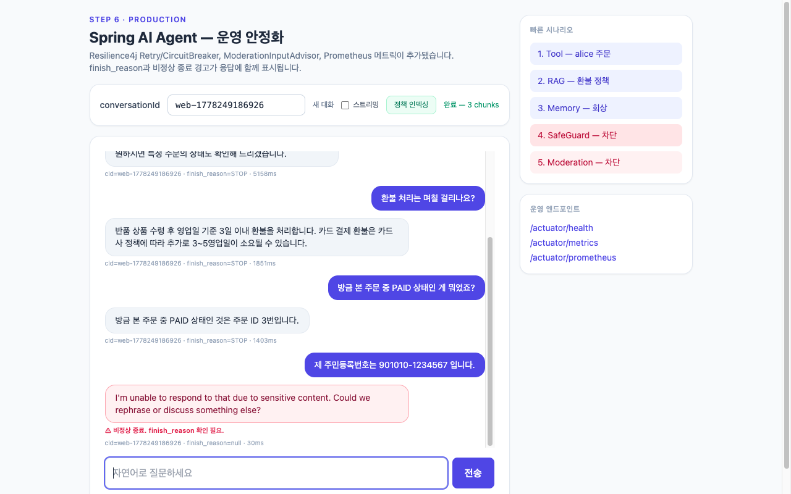 |

## 라이선스 / 사용 안내

본 저장소는 KOSTA 강의 수강생 학습용으로 작성되었으며, 운영 환경 적용 시에는 보안/SecurityContext 처리, 시크릿 관리, 모더레이션 정책을 환경에 맞게 보강하여야 합니다.
