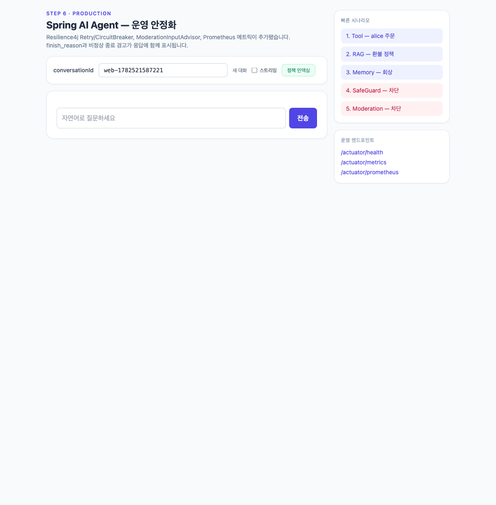
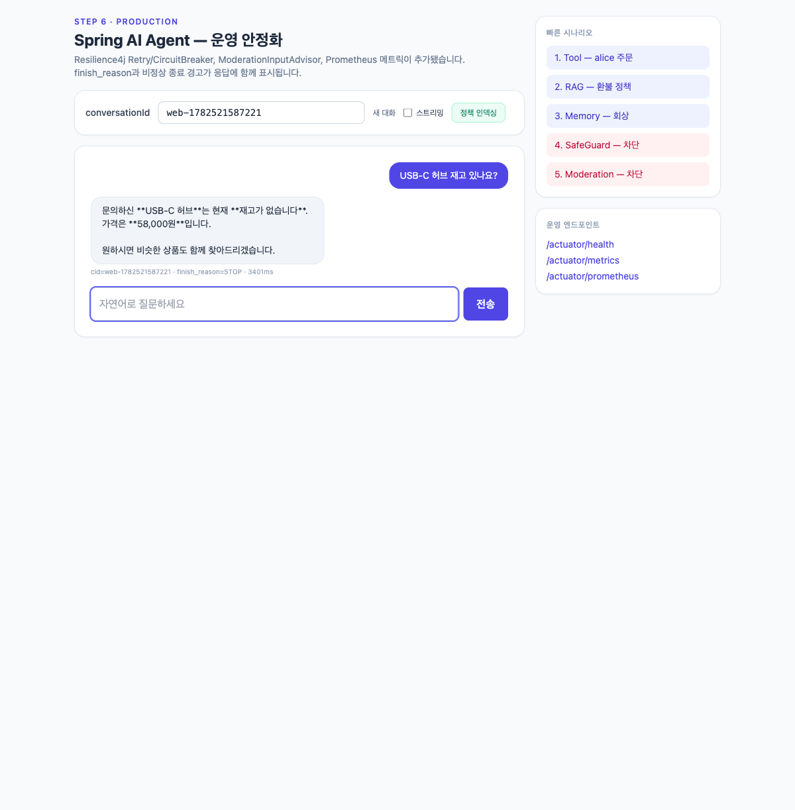
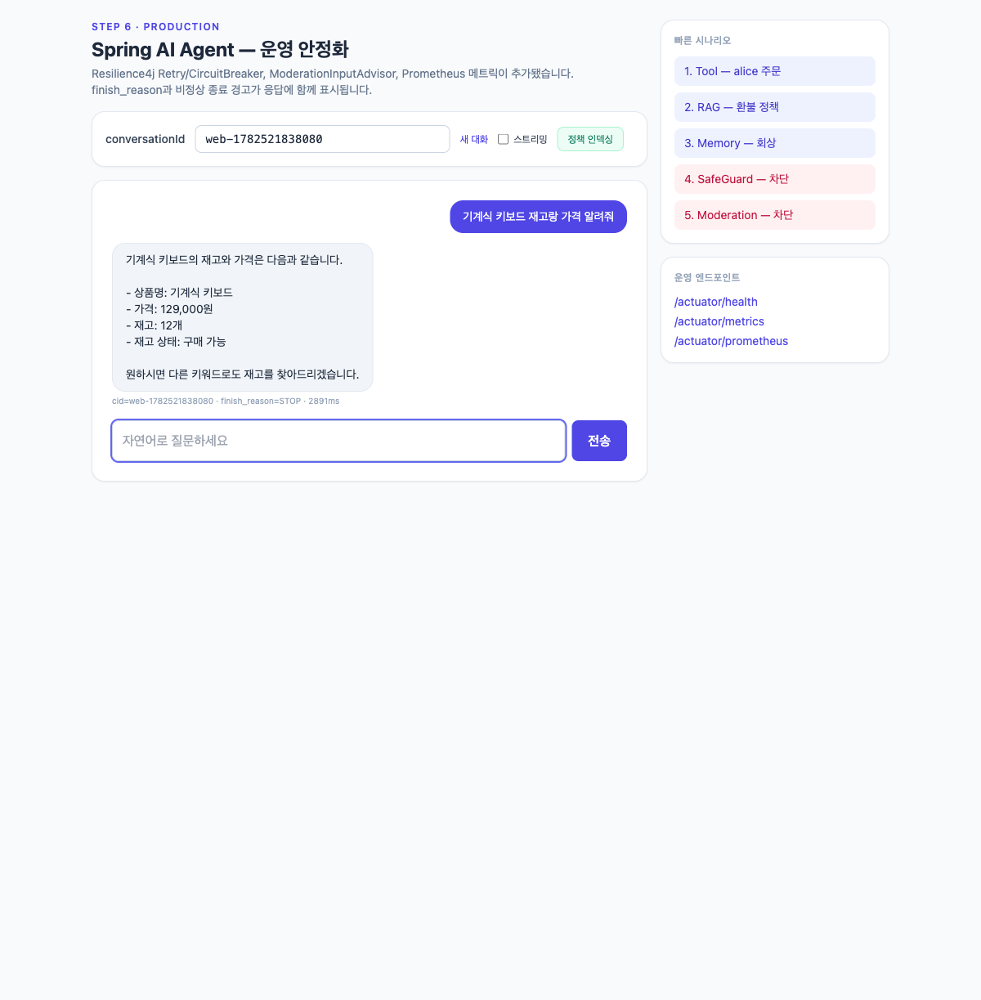
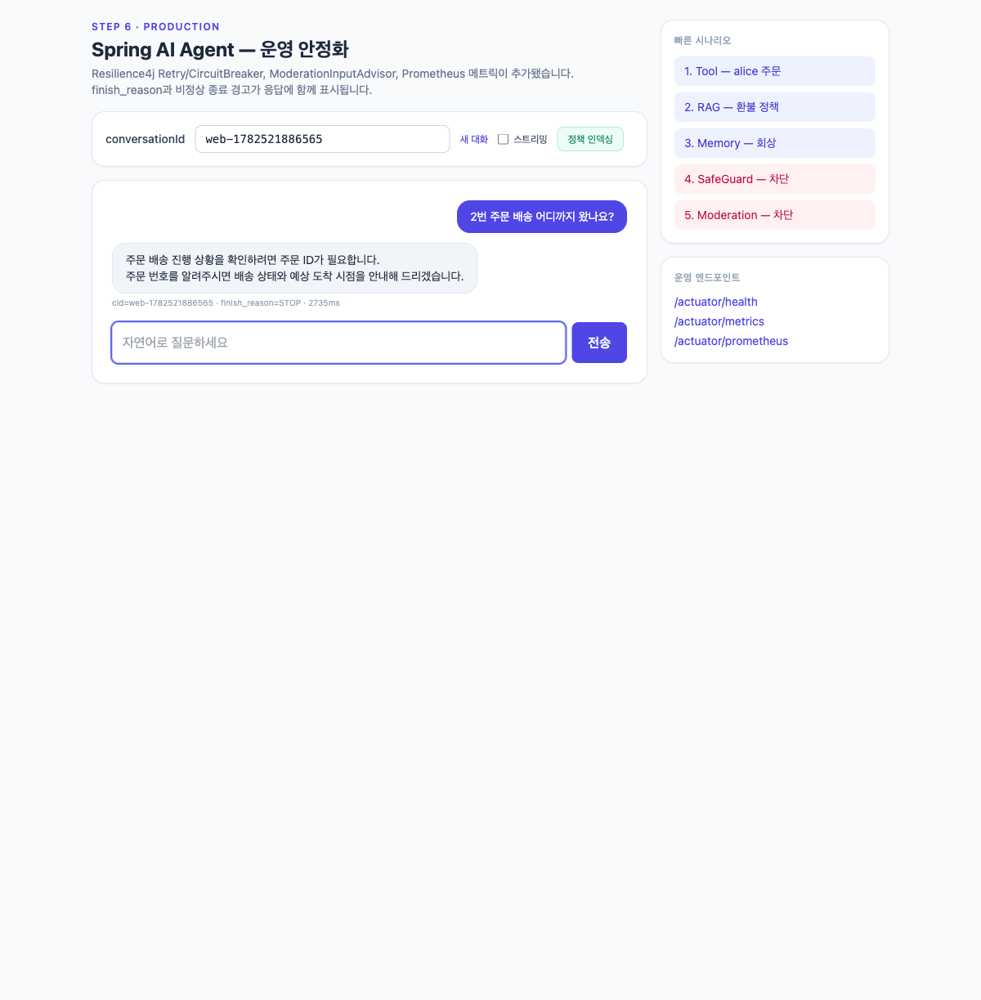
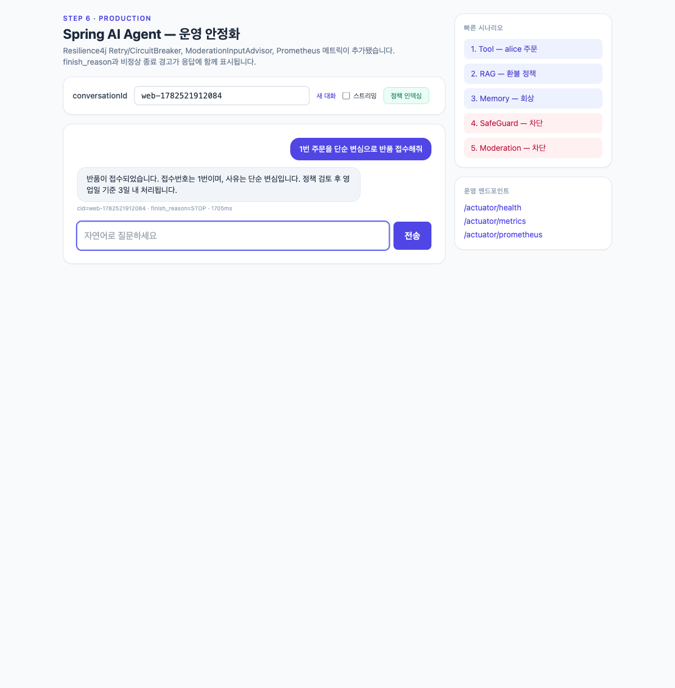
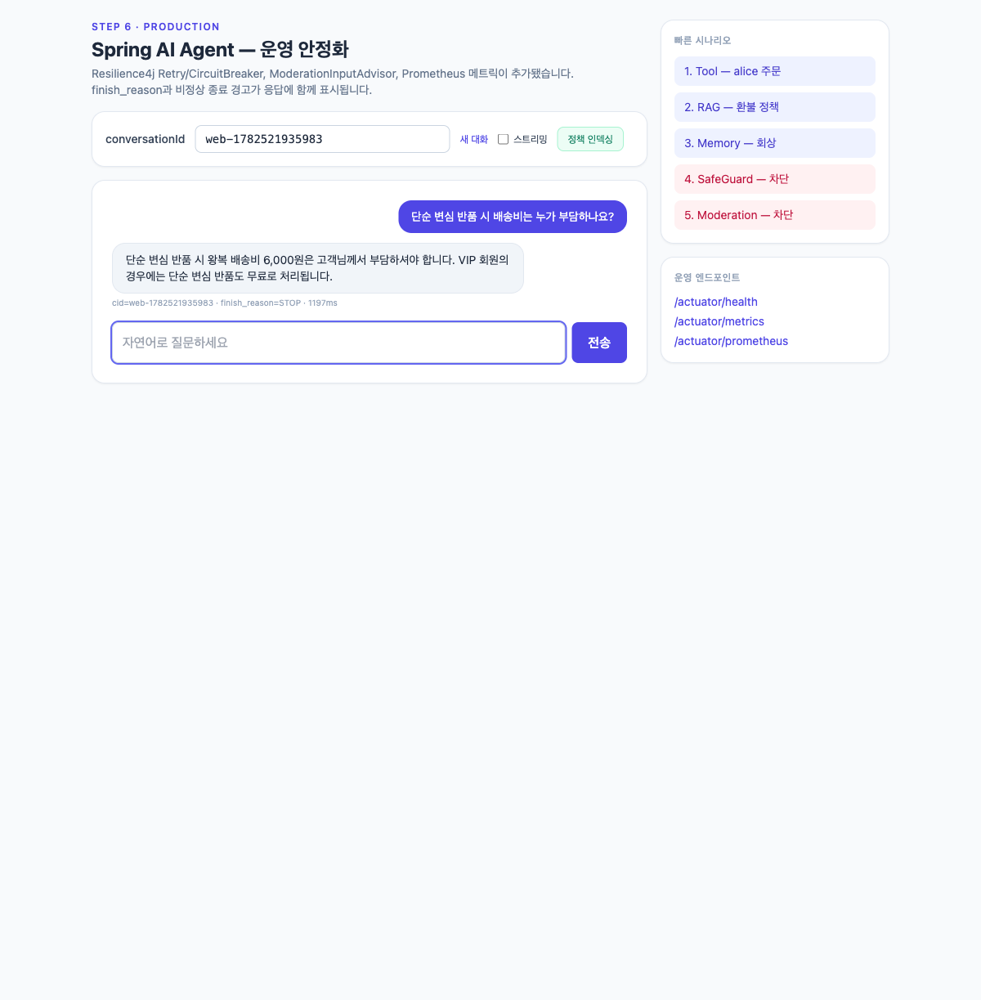
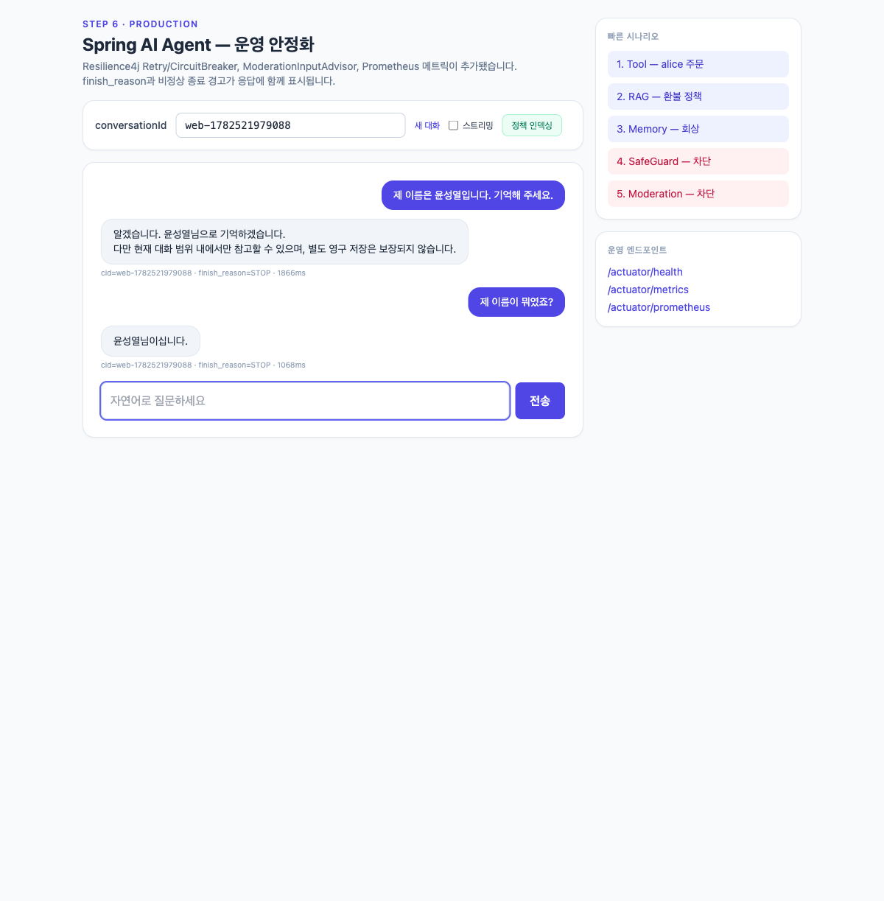
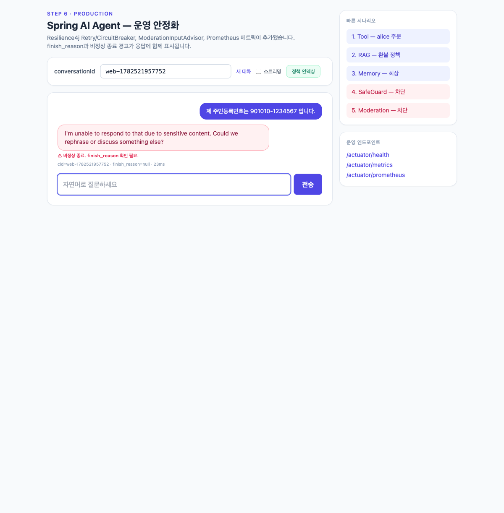

# Spring AI Agent 사용 매뉴얼 (step6-prod 종합)

`step6-prod`는 Chat · Tool Calling · RAG · Memory · SafeGuard에 운영 안정화(Resilience4j · 모더레이션 · 메트릭)와 신규 예제(재고 · 배송 · 반품 도구, 에이전트 패턴, MCP)까지 결합한 완성본입니다. 이 문서는 실행부터 각 기능 활용까지 전 과정을 다룹니다.

> 스크린샷과 "실제 결과" 블록은 OpenAI(gpt-5.4-mini) 라이브 호출로 받은 실제 응답입니다.

## 0. 실행

사전 준비는 **Java 21**과 **`OPENAI_API_KEY`** 뿐입니다. Docker나 외부 DB 서버는 필요하지 않습니다(임베디드 H2 + SimpleVectorStore 사용).

```bash
export OPENAI_API_KEY=sk-...
cd step6-prod
./gradlew bootRun                       # 포트 8080, ./data/agentdb.* 자동 생성
curl -X POST http://localhost:8080/api/index   # RAG 정책 문서 인덱싱(최초 1회)
```

웹 UI는 `http://localhost:8080` 에서 자동 서빙됩니다(자연어 채팅 입력 + 빠른 시나리오 버튼).



시드 데이터: 고객 alice(GOLD)·bob(BASIC), 주문 4건(1번 기계식 키보드 DELIVERED, 2번 27인치 모니터 SHIPPED, 3번 USB-C 허브 PAID, 4번 노이즈캔슬링 헤드폰 PENDING), 상품 5종(USB-C 허브는 품절).

---

## 1. 화면(채팅) 기능

각 기능은 `POST /api/agent`(UI 입력창)로 호출합니다. 형식: 무엇을 하는가 → 사용 예 → 결과 → 관찰 포인트.

### 1.1 주문·고객 조회 (Tool Calling)

- **무엇**: `findCustomer`·`getRecentOrders`·`getOrderStatus` 도구로 DB를 조회합니다.
- **사용**: "alice@example.com 고객의 최근 주문 알려주세요."


- **관찰**: 주문 조회·취소 도구는 본인 인증(`callerCustomerId`)을 요구합니다. 인증 정보가 없으면 "본인 확인이 필요하다"고 응답합니다(의도된 보안 설계).

### 1.2 재고 확인 (checkInventory) — 신규

- **무엇**: 상품명 키워드로 재고·가격을 조회합니다.
- **사용**: "USB-C 허브 재고 있나요?" / "기계식 키보드 재고랑 가격 알려줘"




- **관찰**: 시드에서 USB-C 허브를 품절(0)로 두어 "재고 없음"(58,000원) 흐름을, 기계식 키보드는 "12개, 구매 가능"(129,000원) 흐름을 보여줍니다.

### 1.3 배송 추적 (trackShipment) — 신규

- **무엇**: 주문 상태 기반으로 배송 진행·예상 도착을 안내합니다.
- **사용**: "2번 주문 배송 어디까지 왔나요?"



- **관찰**: PENDING/PAID(출고 전), SHIPPED(배송 중), DELIVERED(완료), CANCELLED(취소)에 따라 안내가 달라집니다.

### 1.4 반품 접수 (requestRefund) — 신규

- **무엇**: 배송 완료 건의 반품을 접수하고, 상태별로 다르게 처리합니다.
- **사용**: "1번 주문을 단순 변심으로 반품 접수해줘"



- **관찰**: 배송 완료(1번)는 접수번호와 함께 접수됩니다. 미배송(PENDING/PAID) 주문은 "취소가 적합하다"고 안내하고, 배송 중(SHIPPED)은 "수령 후 접수"를 안내합니다. 도구가 상태를 판단해 분기합니다.

### 1.5 정책 답변 (RAG)

- **무엇**: 인덱싱된 정책 문서를 근거로 답변합니다.
- **사용**: "단순 변심 반품 시 배송비는 누가 부담하나요?"



- **관찰**: 재고·배송 같은 도구 영역과 달리, 정책 "설명"은 문서 근거로 답합니다(왕복 배송비 6,000원 고객 부담, VIP 무료). 도구와 RAG가 공존합니다.

### 1.6 대화 메모리 (Memory)

- **무엇**: `conversationId`별로 이전 대화를 기억합니다(임베디드 H2에 JDBC 영속).
- **사용**: "제 이름은 윤성열입니다. 기억해 주세요." → (같은 대화에서) "제 이름이 뭐였죠?"



- **관찰**: 같은 conversationId에서 이전 발화를 회상합니다. 서버를 재시작해도 H2 파일에 남아 유지됩니다.

### 1.7 콘텐츠 안전 (SafeGuard · Moderation)

- **무엇**: 민감정보·위해 요청을 입력 단계에서 차단합니다.
- **사용**: "제 주민등록번호는 901010-1234567 입니다."



- **관찰**: `ModerationInputAdvisor`가 LLM 호출 전에 차단하고 경고를 표시합니다.

---

## 2. 에이전트 패턴 (API) — 신규

UI 없이 API로 동작하는 워크플로우 패턴입니다. 별도 인프라 없이 ChatClient 조합만으로 구현됩니다.

### 2.1 Routing — `POST /api/patterns/route`

문의를 ORDER · POLICY · CHITCHAT로 분류한 뒤 전담 처리기로 분기합니다.

```bash
curl -X POST http://localhost:8080/api/patterns/route \
  -H 'Content-Type: application/json' -d '{"message":"환불 규정이 어떻게 되나요?"}'
```

실제 결과(분류 결과를 함께 반환하여 흐름을 관찰 가능):

| 입력 | 분류(type) | 근거(reasoning) |
|------|-----------|-----------------|
| "2번 주문 배송 언제 와요?" | `ORDER` | 주문 번호로 배송 시점 문의 |
| "환불 규정이 어떻게 되나요?" | `POLICY` | 정책/FAQ 문의 |
| "안녕하세요 오늘 기분이 좋네요" | `CHITCHAT` | 인사·일상 표현 |

### 2.2 Evaluator-Optimizer — `POST /api/patterns/refine`

응답 초안을 생성하고, 평가자가 기준(격식체·공감·다음 행동 안내·200자 이내)을 점검하여 미달이면 재생성합니다(최대 3회).

```bash
curl -X POST http://localhost:8080/api/patterns/refine \
  -H 'Content-Type: application/json' -d '{"message":"배송이 일주일 늦어진 고객에게 사과 안내문을 써줘"}'
```

`attempts`(시도 횟수)와 초안 `history`를 함께 반환합니다. 기준을 한 번에 통과하면 `attempts=1`, 미달이면 피드백을 반영해 재작성한 이력이 쌓입니다.

---

## 3. MCP 연동 (선택)

MCP는 기본 실행에서 꺼져 있습니다. 다음으로 활성화합니다.

```bash
./gradlew bootRun --args='--spring.profiles.active=mcp'
```

- **서버 방향**: 주문 도구(`OrderMcpTools`의 `@McpTool`)가 `http://localhost:8080/sse`로 노출되어, 외부 MCP 호스트(Claude Desktop 등)가 사용할 수 있습니다.
- **클라이언트 방향**: 외부 MCP 서버의 도구를 소비하려면 `application-mcp.yml`의 `mcp.client`를 켜고 연결을 등록합니다.

---

## 부록: 스크린샷 재생성

이 문서의 화면 스크린샷(`docs/screenshots/usage/`)은 아래 스크립트로 다시 생성할 수 있습니다(앱 실행 + agent-browser 필요).

```bash
bash scripts/capture-usage-screenshots.sh
```
