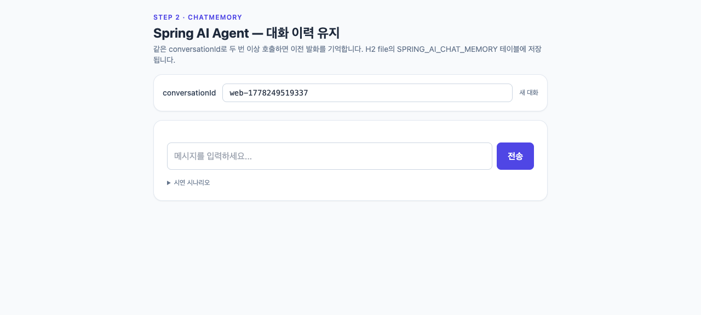

# step2-memory — JDBC ChatMemory + 다중 세션 대화

`MessageWindowChatMemory`와 `MessageChatMemoryAdvisor`를 추가하여 사용자별/세션별 대화 맥락을 유지합니다.

## 목표

- JDBC 기반 `ChatMemory`(슬라이딩 윈도우 10건)를 빈으로 등록한다.
- `MessageChatMemoryAdvisor`를 `defaultAdvisors`에 추가한다.
- 컨트롤러에서 `conversationId`를 받아 advisor 파라미터로 주입한다.

## 추가/변경 파일

| 종류 | 경로 | 설명 |
|------|------|------|
| 변경 | `config/AgentConfig.java` | `ChatMemory` 빈 + `MessageChatMemoryAdvisor` 등록 |
| 변경 | `web/AgentController.java` | `conversationId` 파라미터 + advisor 파라미터 주입 |
| 변경 | `build.gradle.kts` | `spring-ai-starter-model-chat-memory-repository-jdbc` 추가 |
| 변경 | `application.yml` | `spring.ai.chat.memory.repository.jdbc.initialize-schema: always` |

## 사전 준비

- Java 21 + `OPENAI_API_KEY` 환경변수만 있으면 됩니다.
- ChatMemory 테이블은 H2 file DB(`./data/agentdb`)에 자동 생성됩니다.

## 실행

```bash
export OPENAI_API_KEY=sk-...
./gradlew bootRun
```

## 데모

`./gradlew bootRun` 후 http://localhost:8080 에 접속하면 정적 UI가 자동으로 서빙됩니다. UI 상단에 `conversationId` 입력 필드가 노출됩니다.

### 시나리오

| 화면 | 설명 |
|---|---|
|  | 초기 화면 — 기본 conversationId(`u-1`)가 설정된 상태 |
|  | "제 이름은 앤디입니다."를 보낸 직후 — 이력이 ChatMemory에 적재됨 |
|  | 같은 conversationId로 "제 이름이 뭐였죠?" 질의 시 이전 발화 회상 |

### 시도해 볼 것

- 같은 `conversationId`로 이름을 알려준 뒤 회상 질문하여 메모리 동작 확인
- `conversationId`를 `u-2`로 바꾼 후 같은 질문을 던져 세션이 격리되는지 확인
- 같은 세션에서 11개 이상 메시지를 주고받아 슬라이딩 윈도우(10건) 누락이 발생하는지 확인

## 5가지 체크포인트

1. 부팅 후 H2에 `SPRING_AI_CHAT_MEMORY` 테이블이 자동 생성된다 (H2 콘솔이나 `INFORMATION_SCHEMA.TABLES`로 확인)
2. 같은 `conversationId`로 두 번 호출하면 이전 질문을 기억한다
   - 1번째: `{"message":"제 이름은 앤디입니다.","conversationId":"u-1"}`
   - 2번째: `{"message":"제 이름이 뭐였죠?","conversationId":"u-1"}`
3. 다른 `conversationId`로 호출하면 이전 발화를 기억하지 않는다
4. 슬라이딩 윈도우(10건) 초과 시 가장 오래된 메시지가 누락된다
5. DB row 직접 조회 시 user/assistant 메시지가 순서대로 적재되어 있다

## 한계

- 도구를 호출할 수 없으므로 "내 주문 취소해줘" 요청은 환각 응답을 한다 (step3에서 해결)

## 운영 환경 전환 안내

`application.yml`의 `datasource`를 PostgreSQL로 교체하면 동일한 코드가 그대로 동작합니다. JDBC ChatMemory 스키마가 PostgreSQL에 동일하게 생성됩니다. 이는 Spring의 PSA(Portable Service Abstraction) 가치 그 자체입니다.
