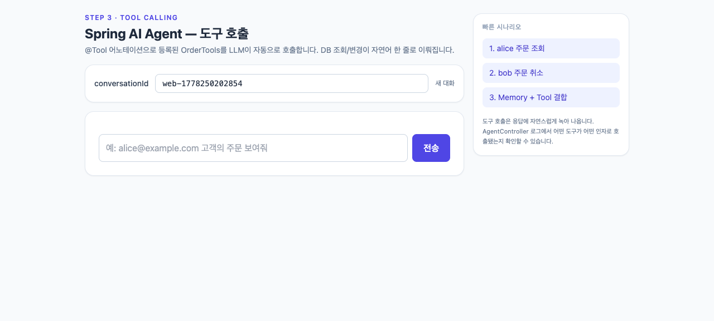

# step3-tools — Tool Calling 4종 도입

자연어 의도에서 LLM이 적절한 도구 메서드를 선택해 실제 DB 작업까지 수행하도록 합니다.

## 목표

- `@Tool`/`@ToolParam` 어노테이션으로 4개 도구를 등록한다.
- `ChatClient.Builder.defaultTools(orderTools)`로 모든 호출에 도구 노출.
- 호출자 권한 검증(`callerCustomerId`)을 도구 파라미터로 명시한다.
- `cancelOrder`는 `@Transactional`로 트랜잭션 경계 내에서 상태를 갱신한다.

## 추가/변경 파일

| 종류 | 경로 | 설명 |
|------|------|------|
| 추가 | `tool/OrderTools.java` | `findCustomer`, `getRecentOrders`, `getOrderStatus`, `cancelOrder` |
| 변경 | `config/AgentConfig.java` | `defaultTools(orderTools)` 추가 |
| 변경 | `web/AgentController.java` | step2와 동일 시그니처 유지 (도구는 advisor와 별개) |

## 권한 검증 정책

본 학습용 코드는 호출자 ID(`callerCustomerId`)를 도구 파라미터로 명시적으로 받습니다.
운영 환경에서는 `SecurityContextHolder`에서 인증 주체를 꺼내 검증해야 합니다.
LLM이 `callerCustomerId`를 임의로 변조할 가능성이 있으므로, 운영 코드에서는 반드시
도구 메서드 내부에서 SecurityContext를 직접 조회하여 본인 ID로 덮어써야 합니다.

## 사전 준비

- Java 21 + `OPENAI_API_KEY` 환경변수만 있으면 됩니다.
- DB는 H2 file (`./data/agentdb`)로 자동 생성됩니다.

## 실행

```bash
export OPENAI_API_KEY=sk-...
./gradlew bootRun
```

## 데모

`./gradlew bootRun` 후 http://localhost:8080 에 접속하면 정적 UI가 자동으로 서빙됩니다. UI에 시나리오 버튼이 노출됩니다.

### 시나리오

| 화면 | 설명 |
|---|---|
|  | 초기 화면 — "1. Tool — alice 주문" 버튼이 노출된 상태 |
|  | 시나리오 버튼 클릭 시 `findCustomer`/`getRecentOrders` 도구가 자동 실행되어 GOLD 등급 alice의 주문이 자연어로 요약됨 |

### 시도해 볼 것

- "1. Tool — alice 주문" 버튼을 클릭하여 LLM이 도구를 선택/연쇄 호출하는 흐름 확인
- "주문 ORD-1을 취소해줘"를 보내 `cancelOrder`가 트랜잭션 내에서 상태를 CANCELLED로 갱신하는지 확인
- 이미 DELIVERED 상태인 주문 취소를 시도하여 도구 메서드의 가드 분기 응답 확인

## 5가지 체크포인트

1. "alice@example.com 고객 정보 알려줘" 요청에 `findCustomer` 도구가 호출되어 GOLD 등급 정보 반환
2. "내 최근 주문 보여줘 (callerCustomerId=1)" 요청 시 alice의 주문 3건이 자연어로 요약됨
3. `cancelOrder`로 PENDING 상태 주문을 취소하면 DB의 status가 CANCELLED로 변경된다
4. 이미 DELIVERED 상태 주문 취소 시도 시 "취소할 수 없습니다" 응답
5. callerCustomerId를 다른 사용자 ID로 보낼 경우 SecurityException 또는 FORBIDDEN 반환

## 한계

- 정책 문서(반품 규정 등)는 모르는 상태이므로 환각 위험이 있다 (step4에서 RAG 도입)

## 운영 환경 전환 안내

`application.yml`의 `datasource`를 PostgreSQL로 교체하면 동일한 코드가 그대로 동작합니다. 이는 Spring의 PSA(Portable Service Abstraction) 가치 그 자체입니다.
