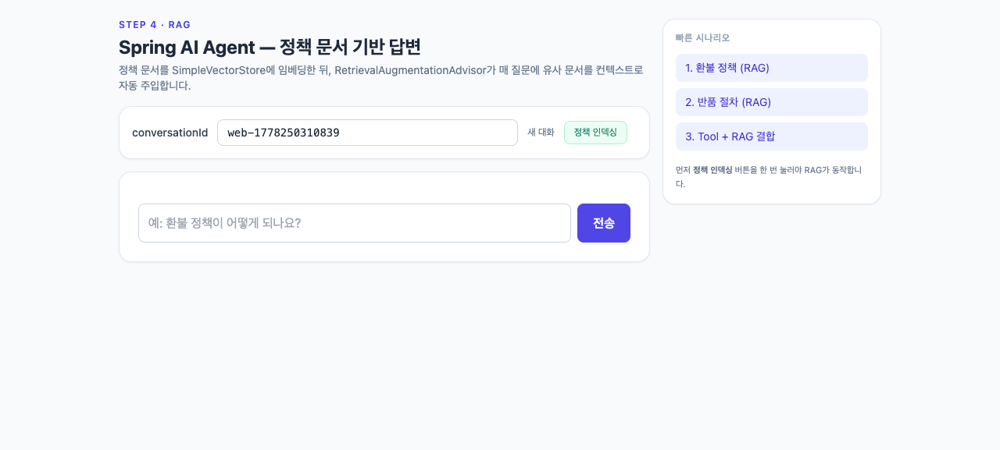

# step4-rag — SimpleVectorStore 기반 RAG

정책 문서를 임베딩하여 `SimpleVectorStore`에 적재하고, `RetrievalAugmentationAdvisor`로 질의에 컨텍스트를 주입합니다. 인덱스는 `./data/vector-store.json` 파일에 저장되어 재기동 시에도 유지됩니다.

## 목표

- `SimpleVectorStore` + `spring-ai-rag` 의존성 구성.
- `classpath:docs/*.txt` 정책 문서를 토큰 단위로 청킹해 적재(`PolicyIndexer`).
- `RetrievalAugmentationAdvisor`를 advisor 체인에 등록.
- 정책 질문(반품, 배송, FAQ)에 검색된 문서를 근거로 답하도록 시스템 프롬프트 보강.

## 추가/변경 파일

| 종류 | 경로 | 설명 |
|------|------|------|
| 추가 | `rag/PolicyIndexer.java` | classpath 문서 토큰 청킹 + SimpleVectorStore 적재 |
| 추가 | `resources/docs/order-policy.txt` | 주문 정책 |
| 추가 | `resources/docs/return-policy.txt` | 반품/교환 정책 |
| 추가 | `resources/docs/faq.txt` | 자주 묻는 질문 |
| 변경 | `config/AgentConfig.java` | `SimpleVectorStore` 빈 + `RetrievalAugmentationAdvisor` 추가 |
| 변경 | `web/AgentController.java` | `POST /api/index` 엔드포인트 추가 |
| 변경 | `build.gradle.kts` | `spring-ai-advisors-vector-store`, `spring-ai-rag` 추가 |
| 변경 | `application.yml` | `embedding.options.model` 추가 |

## 데이터 흐름

| 항목 | 위치 |
|------|------|
| 도메인 데이터 (Customer/Order) | H2 file `./data/agentdb` |
| ChatMemory | H2 file `./data/agentdb` |
| Vector Store (임베딩 인덱스) | 파일 `./data/vector-store.json` (`SimpleVectorStore.save/load`) |

## 멱등성

`PolicyIndexer.indexAll()`은 호출 시마다 청크를 추가합니다. 운영에서는 EventListener 패턴(체크섬 비교 후 `delete()` 후 `add()`) 또는 별도 `processed_docs` 테이블로 중복 인덱싱을 막아야 합니다.
학습 단계에서는 호출을 1회만 하시거나, `./data/vector-store.json` 파일을 삭제하여 인덱스를 비운 뒤 재인덱싱하시기 바랍니다.

## 사전 준비

- Java 21 + `OPENAI_API_KEY` 환경변수만 있으면 됩니다.
- DB와 벡터 인덱스 모두 `./data/` 하위 파일로 자동 생성됩니다.

## 실행

```bash
export OPENAI_API_KEY=sk-...
./gradlew bootRun

# 인덱싱 트리거 (1회)
curl -X POST http://localhost:8080/api/index
```

## 데모

`./gradlew bootRun` 후 http://localhost:8080 에 접속하면 정적 UI가 자동으로 서빙됩니다. UI 상단에 "정책 인덱싱" 버튼이 노출됩니다.

### 시나리오

| 화면 | 설명 |
|---|---|
|  | 초기 화면 — 정책 인덱싱 전 상태로, 정책 질문에 답할 근거가 없는 상태 |
|  | "정책 인덱싱" 버튼 클릭 후 `./data/vector-store.json` 파일이 생성되고 임베딩이 적재된 상태 |
|  | "환불 정책 알려줘" 시나리오 실행 시 `RetrievalAugmentationAdvisor`가 정책 문서를 검색하여 인용한 응답 |

### 시도해 볼 것

- 인덱싱 전후로 동일한 정책 질문을 던져 RAG 효과 비교
- "오늘 날씨 알려줘"처럼 정책 코퍼스 밖 질문을 던져 "모릅니다" 류 응답이 나오는지 확인
- `application.yml`의 `similarityThreshold`를 0.7로 올린 뒤 검색 누락이 늘어나는지 확인

## 5가지 체크포인트

1. `/api/index` 호출 후 `./data/vector-store.json` 파일이 생성되고 임베딩이 적재됨
2. "환불 정책 알려줘" 질의 시 응답에 정책 문장 일부가 그대로 인용됨
3. 정책에 없는 질문(예: "오늘 날씨 알려줘")에는 "모릅니다" 류 응답 반환
4. `similarityThreshold: 0.3`을 0.7로 올리면 검색 누락이 늘어나 "모릅니다" 응답이 증가
5. `topK: 4`를 1로 낮추면 답이 단편적이 되고, 8로 올리면 토큰 사용이 증가

## 한계

- SafeGuard, 모더레이션, 로깅 어드바이저가 아직 없다 (step5/6에서 추가)
- `SimpleVectorStore`는 인메모리(파일 스냅샷)라 단일 노드/소규모 코퍼스에 적합 (운영은 pgvector 등으로 전환)

## 운영 환경 전환 안내

`application.yml`의 `datasource`를 PostgreSQL로, VectorStore 의존성을 `spring-ai-starter-vector-store-pgvector`로 바꾸면 동일한 코드가 그대로 동작합니다. 이는 Spring의 PSA(Portable Service Abstraction) 가치 그 자체입니다.
