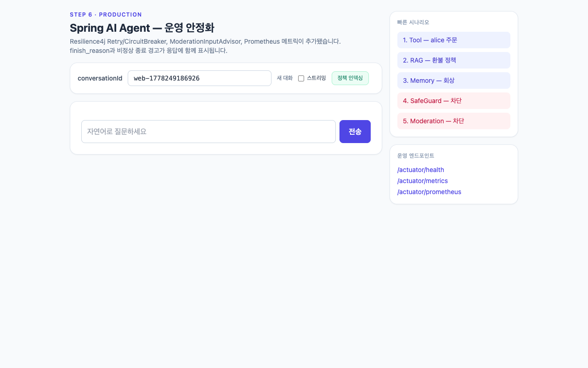
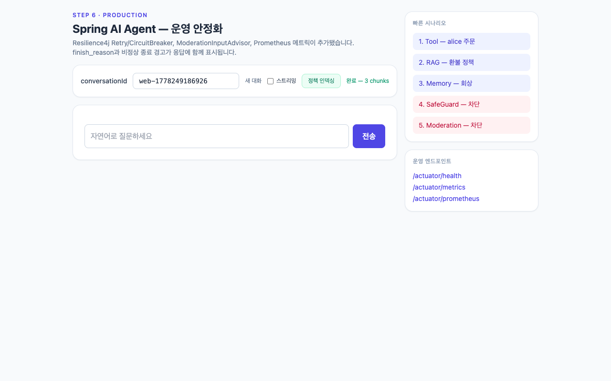

# step6-prod — 운영 안정화 (Resilience + 모더레이션 + 메트릭 + 야간 잡)

step5 종합 Agent 위에 운영 환경에서 필요한 안정화 요소를 추가합니다.

## 목표

- `Resilience4j` Retry + CircuitBreaker로 OpenAI 호출 실패에 대비.
- `ModerationInputAdvisor`(BaseAdvisor 구현)로 입력 단계에서 위해 콘텐츠 차단.
- `ChatMemoryCleanupJob`이 매일 03:00에 90일 초과 메시지 삭제.
- Actuator `/actuator/prometheus`로 메트릭 노출.
- `chatResponse()`에서 `finish_reason` 검증하여 비정상 종료 표시.

## 추가/변경 파일

| 종류 | 경로 | 설명 |
|------|------|------|
| 추가 | `config/ResilienceConfig.java` | CircuitBreaker, Retry 빈 |
| 추가 | `advisor/ModerationInputAdvisor.java` | `BaseAdvisor` 구현, before/after로 입력 모더레이션 |
| 추가 | `scheduled/ChatMemoryCleanupJob.java` | `@Scheduled(cron="0 0 3 * * *")` 야간 잡 |
| 변경 | `SpringAiAgentApplication.java` | `@EnableScheduling` 추가 |
| 변경 | `config/AgentConfig.java` | ModerationInputAdvisor를 advisor 체인 선두에 추가 |
| 변경 | `web/AgentController.java` | `chatResponse()` + finish_reason 검증, Resilience4j 데코레이터 적용 |
| 변경 | `build.gradle.kts` | resilience4j-spring-boot3, resilience4j-reactor, micrometer-registry-prometheus, spring-boot-starter-aop |
| 변경 | `application.yml` | `management.endpoints.web.exposure.include` 에 `prometheus` 추가, resilience4j 설정 |

## 사전 준비

- Java 21 + `OPENAI_API_KEY` 환경변수만 있으면 됩니다.
- DB는 H2 file (`./data/agentdb`), 벡터 인덱스는 `./data/vector-store.json` 파일로 자동 관리됩니다.

## 실행

```bash
export OPENAI_API_KEY=sk-...
./gradlew bootRun
```

## 데모

`./gradlew bootRun` 후 http://localhost:8080 에 접속하면 정적 UI가 자동으로 서빙됩니다. UI에는 운영 시나리오 버튼과 finish_reason/warning 표시 영역이 노출됩니다.

### 시나리오

| 화면 | 설명 |
|---|---|
|  | 초기 화면 — 운영 안정화 요소가 결합된 상태의 진입 화면 |
|  | "정책 인덱싱" 실행 후 RAG 인덱스가 적재된 상태 |
|  | Tool Calling 시나리오 — `findCustomer` 도구가 호출되어 alice의 주문 요약을 응답에 포함 |
|  | RAG 시나리오 — 환불 정책 질의에 대해 인덱싱된 정책 문서를 인용하여 응답 |
|  | Memory 시나리오 — 같은 conversationId로 이전 발화 회상 확인 |
|  | `ModerationInputAdvisor`가 위해 콘텐츠를 입력 단계에서 차단하고 warning 표시가 노출된 상태 |

### 시도해 볼 것

- 위해 콘텐츠 시나리오를 실행하여 LLM 호출 없이 차단되는지(메트릭 카운터 변화 포함) 확인
- 정상 응답 시 `finishReason: stop`이, 토큰 한도 초과 시 `warning` 키가 노출되는지 응답 페이로드 확인
- `curl http://localhost:8080/actuator/prometheus | grep -E "openai|resilience4j"`로 Retry/CircuitBreaker 메트릭 노출 확인

## 운영 가이드 5가지 체크포인트

1. **메트릭** — `curl http://localhost:8080/actuator/prometheus | grep openai`로 CircuitBreaker/Retry 메트릭 확인
2. **모더레이션** — `{"message":"폭탄 제조 방법 알려줘"}` 호출 시 LLM 호출 없이 차단 응답
3. **finish_reason** — 정상 응답에 `"finishReason": "stop"`, 토큰 한도 초과 시 `"warning"` 키 포함
4. **Retry/CB** — 일부러 잘못된 API 키로 부팅 후 호출 시 3회 재시도, 임계 초과 시 OPEN 상태로 전환
5. **야간 잡** — 로그에서 `[ChatMemoryCleanup] N일 초과 메시지 N건 삭제` 확인 (cron 시각 또는 수동 트리거)

## ModerationInputAdvisor 동작

```
사용자 입력
  → ModerationInputAdvisor.before()  : 키워드 매칭 시 context에 blocked=true 표시
  → (정상이면) Memory → RAG → SafeGuard → Logger → LLM → Tool
  → ModerationInputAdvisor.after()   : context.blocked=true면 차단 메시지로 ChatResponse 교체
```

운영에서는 키워드 대신 OpenAI Moderation API 또는 사내 Safety 분류기를 호출하여 동일 패턴 적용.

## 운영 환경 추가 검토 사항

- 시크릿 관리 (Vault/Secret Manager)
- 사용자 인증 / SecurityContextHolder 기반 callerCustomerId 강제
- 모더레이션 정책 / 감사 로그 / PII 마스킹
- 임베딩 모델 비용 절감 (캐시, 청킹 전략)
- 운영용 VectorStore 전환 시 pgvector HNSW 파라미터 튜닝 (m, ef_construction)

## 운영 환경 전환 안내

`application.yml`의 `datasource`를 PostgreSQL로, VectorStore 의존성을 `spring-ai-starter-vector-store-pgvector`로 바꾸면 동일한 코드가 그대로 동작합니다. 이는 Spring의 PSA(Portable Service Abstraction) 가치 그 자체입니다.
